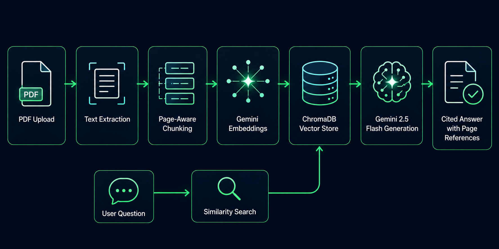

# DocuMind

**A multi-document conversational RAG engine — upload PDFs, query them individually, in groups, or across your entire workspace, with page-level source citations on every answer.**

🔗 **Live Demo:** [documind-client-kohl.vercel.app](https://documind-client-kohl.vercel.app/)

---

## Overview

DocuMind lets you upload PDF documents and ask natural-language questions grounded strictly in their content. Every answer is traceable back to the exact file and page it came from, and you can query a single document, a custom multi-document set, or your entire knowledge base at once.

## Architecture



## Key Features

- **Flexible retrieval scopes** — chat with one document, a hand-picked selection, or your full "Global Workspace" simultaneously.
- **Page-accurate citations** — every claim in an answer is backed by an inline `[filename - page]` reference, generated directly from retrieved chunk metadata.
- **Persistent conversations** — chat threads and history are stored in SQLite and can be resumed, browsed, or deleted at any time.
- **Resilient retrieval pipeline** — UUID-based document scoping with automatic fallback search, so queries never silently return zero context.
- **Evaluation-driven quality** — a custom RAGAS-style LLM-as-judge harness scores every retrieval/generation run on faithfulness, answer relevance, and context recall.

## Tech Stack

| Layer | Technology |
|---|---|
| Frontend | React, Vite, Tailwind CSS |
| Backend | FastAPI, SQLAlchemy |
| Vector Store | ChromaDB |
| Embeddings & Generation | Google Gemini (`gemini-embedding-001`, `gemini-2.5-flash`) via LangChain |
| Metadata Store | SQLite |
| PDF Parsing | PyMuPDF |
| Evaluation | Custom RAGAS-style harness (LLM-as-judge) |

## Evaluation Results

Benchmarked with a custom LLM-as-judge harness (`run_ragas_eval.py`) across faithfulness, answer relevance, and context recall:

| Metric | Score |
|---|---|
| Faithfulness | 100% |
| Answer Relevance | 100% |
| Context Recall | 100% |

## Getting Started

### Backend

```bash
cd backend
pip install -r requirements.txt
# create a .env file with DATABASE_URL, GOOGLE_API_KEY, CHROMA_PERSIST_DIR,
# MAX_CHUNK_SIZE, CHUNK_OVERLAP, TOP_K_RESULTS, SECRET_KEY
uvicorn app.main:app --reload
```

### Frontend

```bash
cd frontend
npm install
npm run dev
```

### Run Evaluation

```bash
python run_ragas_eval.py
```

## License

MIT
